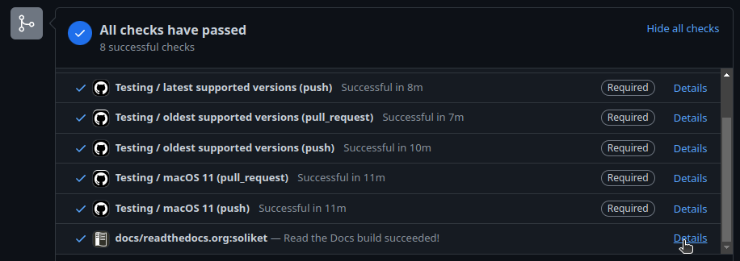

================================
Documenting Your Code in SOLikeT
================================

After you have written your code, created tests and ensured that your code works
and is ready to be included, it might be a good idea to have a look at
**documenting** your code. As you are seeing right now, *SOLikeT* uses
readthedocs for hosting its documentation, and a lot of it is automatically
generated by *sphinx* with the *autodoc* extension.

For you as a developer, this might not mean a lot, so let's focus on the (few)
steps you need to take to get your documentation added here. This is done in
only three simple steps:

1. Annotate your code with **docstrings**, optionally including some nice
   formatting that sphinx can parse.
2. Creating a page where your documentation gets listed, or adding your docs
   to an existing page.
3. Ensuring your page gets added to the index on the left.

Creating Docstrings
-------------------

Let's assume we have made a theory code called ``Pulsars`` that exists in SOLikeT
thanks to our amazing python skills, and now we want to document its use so that
other people can use it as well. Say we put this in ``soliket/Pulsars.py``, and it
looks something like this:

.. code:: python

   """
   .. module:: soliket.pulsars
   
   :Synopsis: A theory code that models a pulsar signal.
   :Author: Jocelyn Bell
   
   We can give a much longer description of our code here. All text we put
   up here will appear at the top of our page in the end for our very long
   description.
   """
   
   class Pulsars(Theory):
       """A Pulsar theory code for SOLikeT."""
       
       def calculate_signal(self, distance, mass):
           """
           Given a pulsar of mass ``mass`` (in solar masses) and a distance
           ``distance`` (in parsecs), calculate a mock signal of a pulse.
           
           :param distance: the distance to the pulsar (in pc).
           :param mass: the mass of the pulsar (in Msun)
           
           :return: A tuple of two arrays, one with some times t (in seconds)
               over which this signal was measured, and one with some fluxes
               (in Jy) for the strength of the signal.
           """
           ...
       
       def extra_function(self):
           """
           This function is needed for internal mechanics, but we might
           not want to add it to our documentation for whatever reason.
           """
           ...

Essentially, we have a class called ``Pulsars`` with a function called
``calculate_signal``. We see three instances of so-called **docstrings**, these
are strings which document (hence the clever name: doc-strings) what the code
does. We see a couple of directives that are going to be parsed by the code
that generated the webpages:

* At the top of the page, we have a docstring that gives a general overview of
  the code. We name our module at the top with a directive, give a synopsis of
  this module, provide an author, and then give a much more descriptive summary
  of what this module does. All this will get formatted by sphinx and added to
  our webpage.
* Immediately after the class and function definitions, we put docstrings that
  explain what this class (or function) does. If you are unsure what to put as
  a description of your class, have a look at other documentation pages in
  here and in other projects to get an idea of what would be good summaries.
* When writing docstrings for functions, good practice is to (at minimum) write
  descriptions for every parameter and the return value. This can be done (as
  seen in the example) with the ``:param <parname>:`` and ``:return:`` directives.

We also have an extra function called ``extra_function`` that we might need for
technical reasons (e.g. for internal calculations, or as boilerplate code to
interface with other codes elsewhere). Such functions should not need excessive
comments, but it is good practice to give them clear docstrings either way.

Creating a doc page
-------------------

Documentation in SOLikeT can be very easily created from the docstrings  in your
python code. For this, SOLikeT uses the **autodoc** extension for sphinx.

Let's have a look at our Pulsars class we created earlier in the
`Creating Docstrings`_ section.

We start by creating a new, empty text file called ``SOLikeT/docs/pulsars.rst``
(i.e. the file is called ``pulsars.rst`` and it is stored in the ``docs`` folder
of SOLikeT). The contents can be quite simple:

.. code::

   Pulsar Theory Code
   ==================
   
   .. automodule:: soliket.pulsars
   
   .. autoclass:: soliket.Pulsars
       :exclude-members: extra_function
       :members:

At the top we define a title, which is simply **Pulsar Theory Code** (note that
the underline, which is made with ``=`` symbols, needs to be at least as long
as the text it's underlining). We then simply add two directives, one
``automodule`` with the same name as the ``module`` directive at the top of
our module docstring (see the previous section), and one ``autoclass``
directive that uses the python name of our class. If you have multiple classes,
add multiple ``autoclass`` directives, one for each class you have. The
``:members:`` directive will cause sphinx to turn the docstrings for each of the
class's member functions to be turned into an entry.

Sometimes, your class might inherit a lot of functions from some parent class,
or implement a lot of boilerplate functions that are needed to interface with
some other codes or frameworks. These kinds of functions can at times give
excessive documentation that the end-user might not really need or should not
care about. In our Pulsars example, we had the ``extra_function`` that we did
not want to add to our docs page. For this, there exists the
``:exclude-members:`` directive, that will skip given functions that people
might not need.

Obviously, there are many many more ways in which you can make your documentation
better than whatever example we can come up with. We highly recommend you to
explore the docstrings written by other people, both inside and outside the
SOLikeT codes, to improve on your skills to get other people to understand
your code. The better your documentation, the more likely that other people
will use your codes for better science.

Adding your documentation to the index
--------------------------------------

This step is probably the easiest to do. All you need to do is open the file
``SOLikeT/docs/index.rst``, where you will see a list of ``toctree`` entries,
something like this:

.. code::

   .. toctree::
      :caption: Getting Started
      :maxdepth: 1
      
      index
   
   .. toctree::
      :caption: Theory codes
      :maxdepth: 2
      
      ccl
      cosmopower

Simply take the name of the file you created in the `Creating a doc page`_
section and add it to the list of sections in the correct category. In our case,
we would add a ``pulsars`` entry under the ``cosmopower`` entry. After recompiling,
our page will now appear with a neat little ``Pulsars`` entry in the table of
contents.

Reviewing your documentation
----------------------------

After you have made all your commits and pushed to your pull request, you have
the opportunity to have a look at your own documentation. The workflows for
*SOLikeT* are setup such that readthedocs builds an instanced version of the
documentation generated by your branch, and you can review it by following
the link under the **docs/readthedocs.org:soliket** check that will
automatically generated on your PR.

This link will bring you to a readthedocs page that shows the output of the
build of your documentation. Building the documentation takes about 10 minutes,
so make yourself a cup of tea while you wait. After this time has passed, you
should see a bright green **Build completed** button at the top. If all has
gone well, you can click the **View docs** button on the right to have a look
at your documentation and see if all appears as intended or if you want to make
more edits.

Congratulations! You have now created some very fancy documentation for your
own SOLikeT code!

